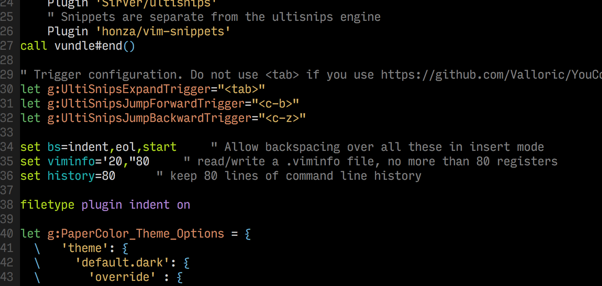

# vimrc

~~Here's my very own vimrc. I've switched to VimR now, and the file is called init.vim.~~  

I've switched to the standard vim in /usr/bin/vim, but I've left the init.vim file here for future reference. Currently, the relevant vimrc is the .vimrc.

Here's a screenshot of my colour scheme, I've overridden the background to make it black (#000000)
